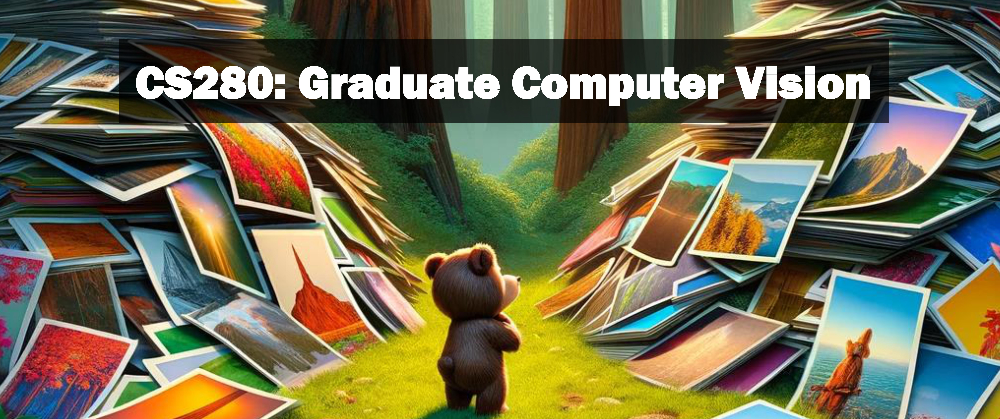

# Logistics

UC Berkeley, Spring 2024  
Time: MoWe 12:30PM - 1:59PM  
Location: 1102 Berkeley Way West
Instructor: [Alexei Efros](https://people.eecs.berkeley.edu/~efros)  
GSIs:
- [Lisa Dunlap](https://www.lisabdunlap.com/)
- [Suzie Petryk](https://suziepetryk.com/)

**Office hours - Room 1204, first floor of Berkeley Way West** 

- Suzie: Thursday 11-12pm

- Lisa: Wed 11:30-12:30pm

**Email policy:** Please see the [syllabus](https://cs280-berkeley.github.io/resources/CS_280_Spring_2024_Syllabus.pdf) for the course email address. To keep discussions organized, please do not email the instructor or GSIs directly. We will not reply to any course-related emails except at this address.

We are using Ed Discussion for communication (private or public) as much as possible.

**Magical course textbook that isn't  actually out:** [Foundations of Computer Vision](https://mitpress.mit.edu/9780262048972/foundations-of-computer-vision/) by Antonio Torralba, Phillip Isola and William T. Freeman. 

## Lectures

Lecture slides will be posted online.

* Lecture 1: (1/17) [Introduction to Computer Vision](https://drive.google.com/file/d/1nbQe6K7yrtVGOkrEY8g6iVmvmPtgCuTE/view?usp=sharing)
* Lecture 2: (1/22) [Fundamentals of Image Formation](https://drive.google.com/file/d/1llg4aQr-rYFQUO0RFzcK277A0g2U6KNs/view?usp=sharing)
* Lecture 3: (1/24) [Blocks World: A Simple Vision System](https://drive.google.com/file/d/1z4N4kdPNDWNvgtmC7zDLanWCx4CoDSMh/view?usp=sharing)
* Lecture 4: (1/29) [Transformations](https://drive.google.com/file/d/1FeOpe_ACpOTNEK5gHUK0RwyyBwj7f0Oh/view?usp=sharing)
* Lecture 5: (1/31) [Radiometry](https://drive.google.com/file/d/1JE2d8ZfsCr1LYM5bqvWSkbn0zUdJHKVi/view?usp=sharing)
* Lecture 6: (2/5) [Biological Vision Pt. 1](https://drive.google.com/file/d/1sWZDqlWHPiexhnOjQkU7ts-xP_-haeRl/view?usp=sharing)
* Lecture 7: (2/7) [Biological Vision Pt. 2](https://drive.google.com/file/d/1sWZDqlWHPiexhnOjQkU7ts-xP_-haeRl/view?usp=sharing)
* Lecture 8: (2/12) [Linear Systems in Vision](https://drive.google.com/file/d/1ImOvO_BdXEE9vsbQY_7OADGWoLGIsxi3/view?usp=sharing)
* Lecture 9: (2/14) [Spatial & Temporal Filtering](https://drive.google.com/file/d/1_fULF0b1Gqxd3DM1Y3J8CzoDTkGBp1b8/view?usp=sharing)
* Lecture 10: (2/21) [Sampling, Reconstruction, Pyramids](https://drive.google.com/file/d/1nUb3yt_XhQ6DALpsdMHg63qVE0QVqbQj/view?usp=sharing)
* Lecture 11: (2/26) [Pyramids and Conv Nets](https://drive.google.com/file/d/1C1Qy5nWQzgVnfTsJQ-lEfe4KYMIKyE0T/view?usp=sharing)
* Lecture 12: (2/28) [Conv Nets Pt 2](https://drive.google.com/file/d/1nEHajYJoTx4sxEGhwvW6RtlzcQHMl5kQ/view?usp=sharing)
* Lecture 13: (3/4) [ConvNets Pt 3](https://drive.google.com/file/d/1ow8HEjpcytkN7R9uhecnRYNoseVovjaL/view?usp=sharing)
* Lecture 14: (3/6) [Representation Learning](https://drive.google.com/file/d/1z5hmeDMtTcBOmFNudOUAObe9A_Qk-wYV/view?usp=sharing)
* Lecture 15: (3/11) [Transformers!](https://drive.google.com/file/d/1UwyGAONtktCzuSbW2VUj6Dd488OXH9BQ/view?usp=sharing)
* Lecture 16: (3/13) [Representation Learning pt 2](https://drive.google.com/file/d/1z5hmeDMtTcBOmFNudOUAObe9A_Qk-wYV/view?usp=sharing)
* Lecture 17: (3/18) [Self-Supervised Learning](https://drive.google.com/file/d/1Ym1wr8rXGunl-TgVdV_5DNegfmzFLws8/view?usp=sharing)
* Lecture 18: (3/20) [Self-Supervised Learning Pt 2](https://drive.google.com/file/d/1Ym1wr8rXGunl-TgVdV_5DNegfmzFLws8/view?usp=sharing)
* Lecture 19: (4/1) [Texture Models](https://drive.google.com/file/d/1o5OnYijZ0TehS_TOASKeBfLQfY6rqtvB/view?usp=sharing)
* Lecture 20: (4/3) [Texture Models pt 2](https://drive.google.com/file/d/1o5OnYijZ0TehS_TOASKeBfLQfY6rqtvB/view?usp=sharing)
* Lecture 21: (4/8) Diffusion Models!
* Lecture 22: (4/10) Maybe more generative model stuff
* Lecture 23: (4/15) Maybe Datasets? Maybe Alyosha will let Lisa co-lecture so this will be the best lecture
* Lecture 24: (4/17) Orthographic Projects are somewhere in here
* Lecture 25: (4/22) Maybe 3D goes here
* Lecture 26: (4/24) ...AGI?

## Assignments

All questions should be asked on Ed or in OH. All assignments will be submitted to bcourses. 

* [HW1 is out!](https://edstem.org/us/courses/54175/discussion/4183683) Due Monday, Feb 5th at 11:59pm
* [HW2 is out!](https://edstem.org/us/courses/54175/discussion/4417564) Due Monday, March 5th at 11:59pm
* [HW3 is out!](https://edstem.org/us/courses/54175/discussion/4685142) Due Tuesday, April 9th at 11:59pm

## Additional Materials

* [Computer Vision: Algorithms and Applications](http://szeliski.org/Book/) (available free online)
* [Spring 2023 Course Website](https://cs280-berkeley.github.io/sp23)

